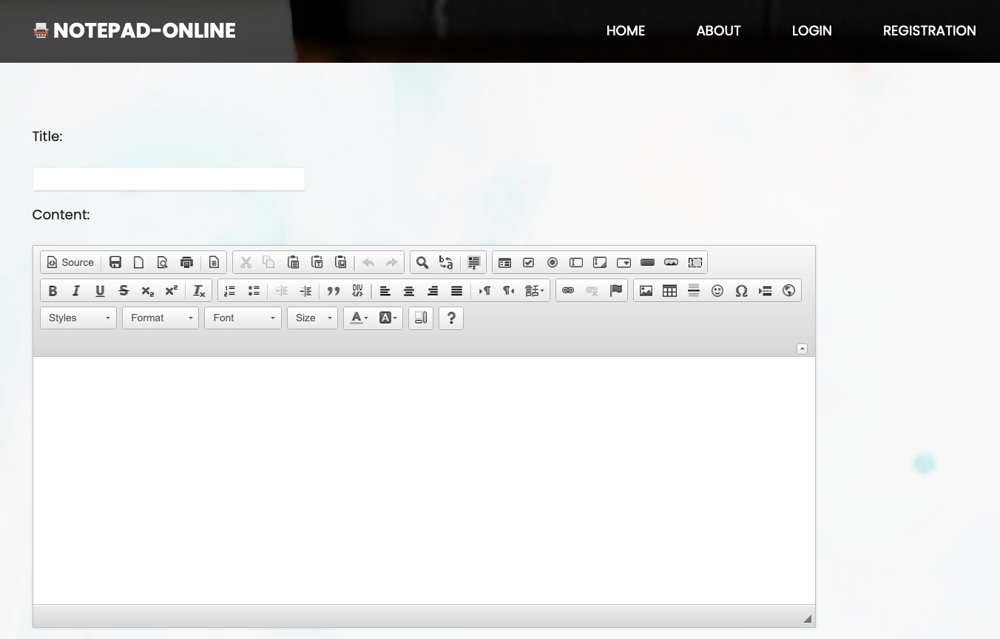

  

  
  
  
  
  
  

## About

Django application "Notepad-online" is created for making notes and downloading them.

## Key features:

- user registration and authentication are implemented 
- Yandex mail server sends the user a letter to reset and change the password
- operations for sending letters, creating and changing notes are implemented through the Celery library, which allows to process a large number of requests
- data about notes and templates are cached in Redis, which reduces the load on the PostgreSQL database and greatly speeds up the transfer of data to the user
- implemented a text editor with functionality for changing text parameters, downloading and printing notes in PDF format
- the entire project is deployed in Docker containers using Docker Compose

## Screenshots:

  

  

## Tests:

  

## In future:

- deploy the project on the remote server
